# **kaist_mad_camp_4**

**Team Name**: 악.깡.버(악으로 깡으로 버텨라!)

 

# **1. Introdutcion of the Project**

&nbsp; We make a new web named QUEUE OVERFLOW. It is similar to Stack Overflow which is famous Q&A website among programers. The main difference between our project and Stack Overflow is whether the website provides Docker container(or similarly, virtual machine) for every Questions. The benefit for using Docker container or Docker Images is that questioner can ask there question with their codes. Anyone can see its codes without version problem and can debugs its codes. Also, using WEB IDE which is connected to Docker Container, everybody can run and check the answer’s code. As a result, this project gets rid of worries for checking whether the code is right or not.

 

# **2. How to Use**

## **About the Website**

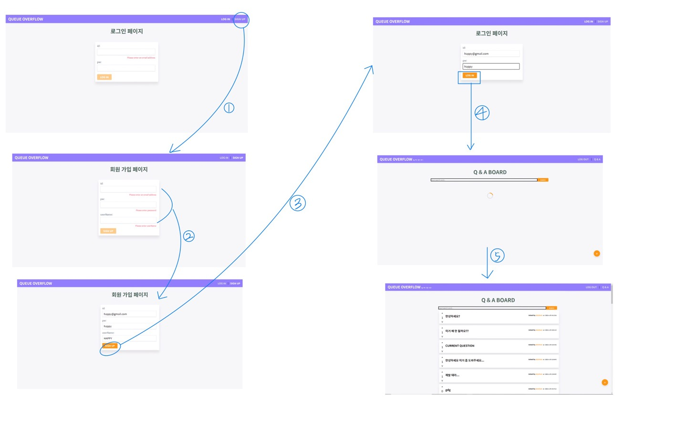

- 1: Press the **Sign Up** buttion on the top right.
- 2: Enter the information.
- 3: Press the **Sign UP** buttion which is colored yellow.
- 4: Enter the previous information and press the **Sing In** button.
- 5: Loading Effect for Q&A Board
  
 

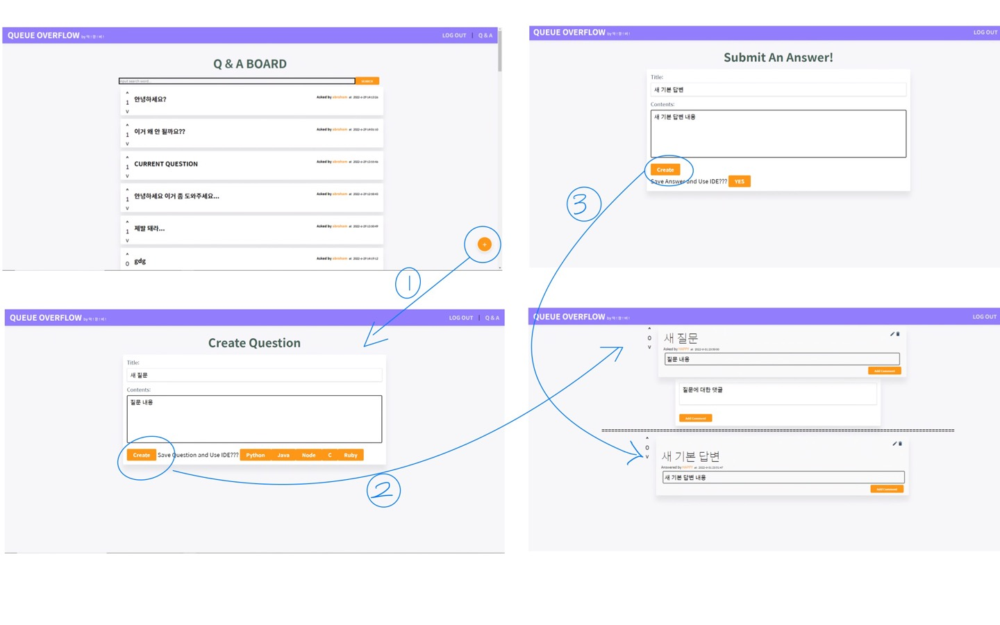

- 1: Press the **create question** button.
- 2: Enter the question and press the **create question** button.
- 3: Press the **create answer** button for the question. As a result, answer is given to the question.

 

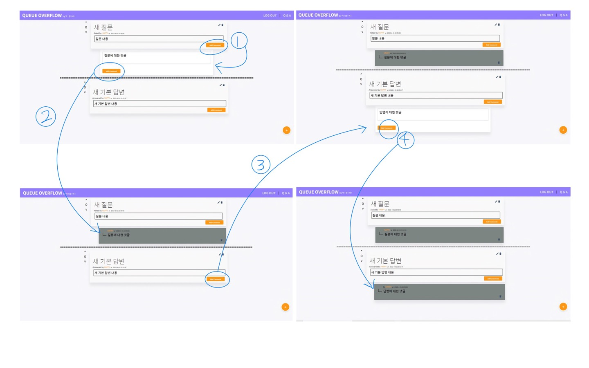

- 1: Press the **add comment** button to the question. Then, a comment is shown which is waiting for the input. 
- 2: Press the **add comment** button. Then the comment is saved and colored as gray.
- 3: Likewise, press the **add comment** button to the answer. Then, a comment is shown which is waiting for the input.
- 4: Press the **add comment** button. Then the comment is saved and colored as gray.

 

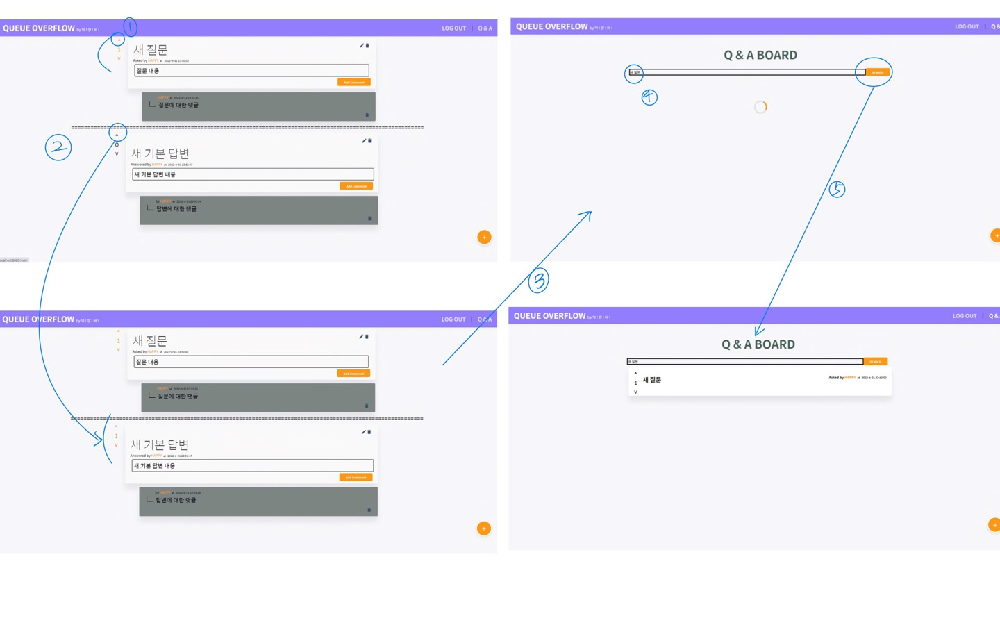

- 1: Press the **Like** button to the question. Then, the button is coloerd as orange and the number of likes is increased.
- 2: Likewise, press the **like** button to the answer.
- 3: Go back to the main page.
- 4: Search the question with its title **includes** "새 질문".
- 5: Press the **SERACH** button.
- 6: You can see the search results.

 

## **About the WEB Integrated Development Environment**

### **Basic Use**
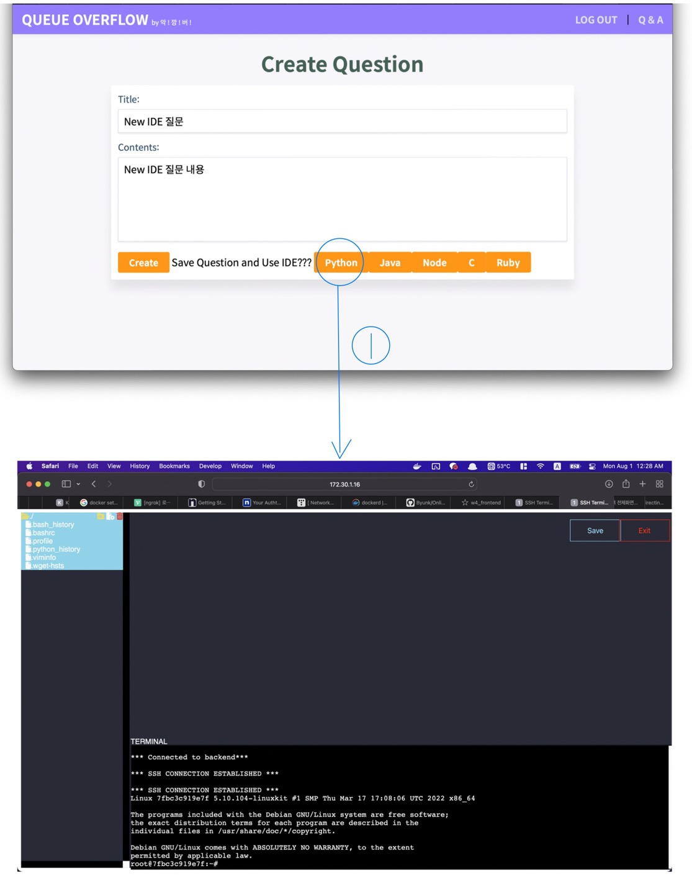
- 1: Press the **create IDE** button for the question. In this figure, make python IDE. It will make a docker container.

 

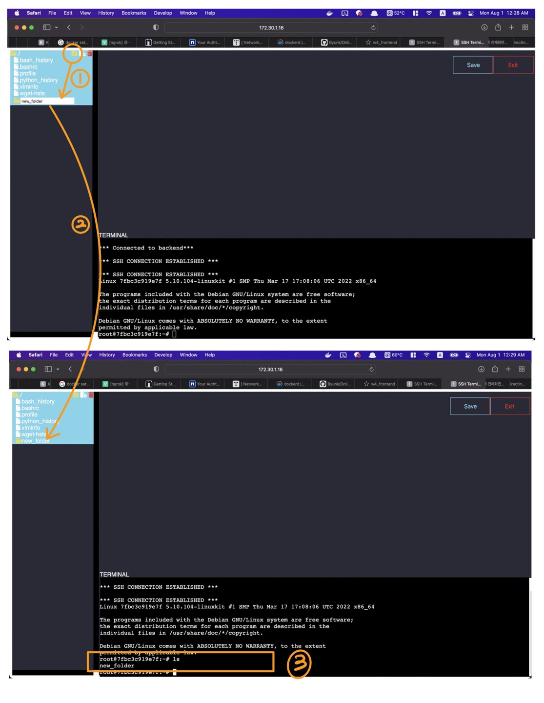
- 1: Press the **new folder** button. Then new folder would be shown and waiting for writing its name.
- 2: After writing the new folder's name, press the **Enter key**.
- 3: New folder which is maken from above can be shown in the terminal.

 

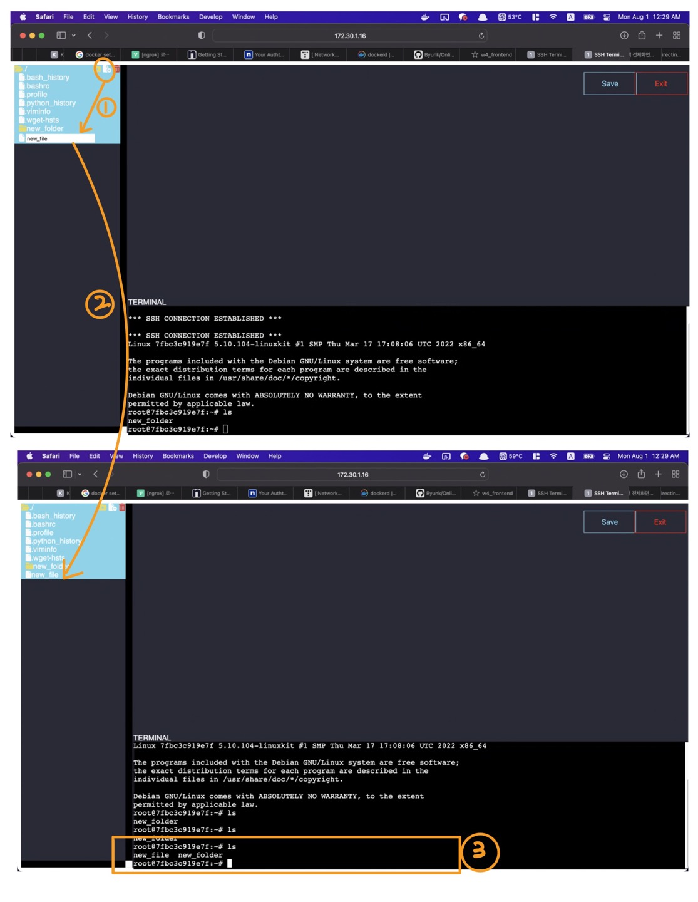
- 1: Press the **new file** button. Then new file would be shown and waiting for writing its name.
- 2: After writing the new file's name, press the **Enter key**.
- 3: New file which is maken from above can be shown in the terminal.

 

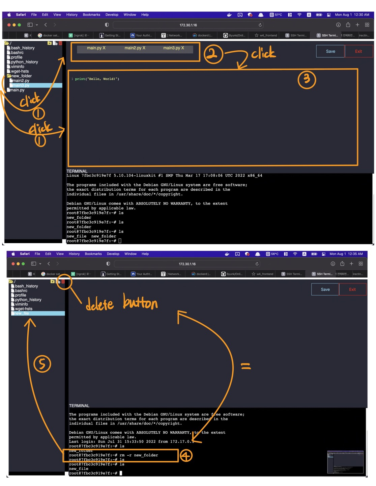
- 1: **Click the files**. Then **new window** would be shown as in the number 2.
- 2: These are windows for files. If you click each of them, its code would be shown in the number 3(code editor).
- 3: This is **code editor**. You can see the code and edit it.
- 4: Pressing the **delete button** is equal to write **"rm -r FOLDER_NAME"** in the terminal. In this example, remove folder named new_folder.
- 5: After deleting folder, you can see results in number 5.

 

### **Question Example**

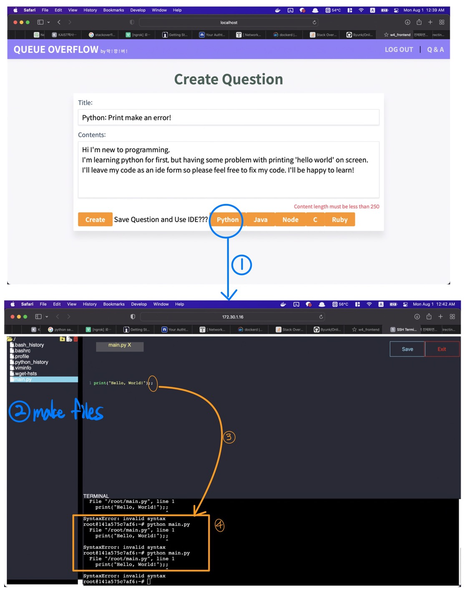
- 1: Create **a new IDE** with python environment. It will make a **docker container**.
- 2: Make a file named main.py. Write the code print("Hello world");; in the code editor.
- 3: Press **Save button** or press **Ctrl+S** in the code editor. Then, run the code using the terminal. Error would be reflected which is maken by code editor.(In this example, ;; is an error.)
- 4: You can see the error in the terminal.
  
 

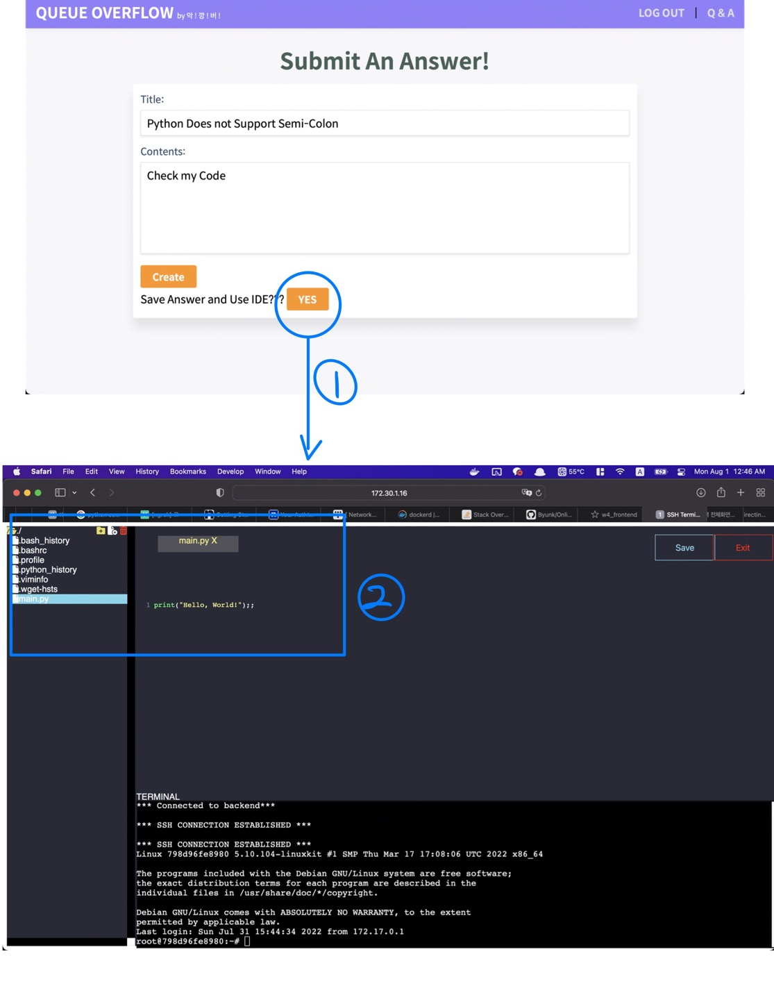
- 1: For writing the answer, you can press the **IDE button** as number 1. It will make **same environment**, same files and folder **for the questioner**.
- 2: You can see the **same file** which is written from questioner. Any body can debug the code for answering.

 

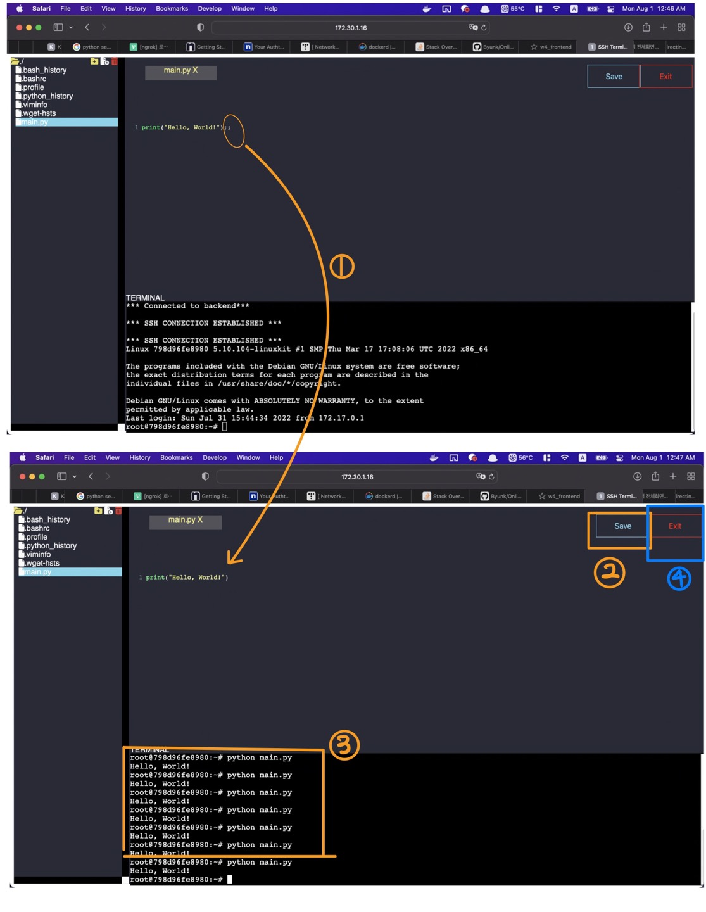
- 1: Delete the wrong code ;; in the code editor.
- 2: Press the **Save button** on the right above.
- 3: Run the code using the terminal and notice that there isn't any error.
- 4: Press the **Exit button**. Then the given docker container is closed and a **docker file** would be saved for the question.

 

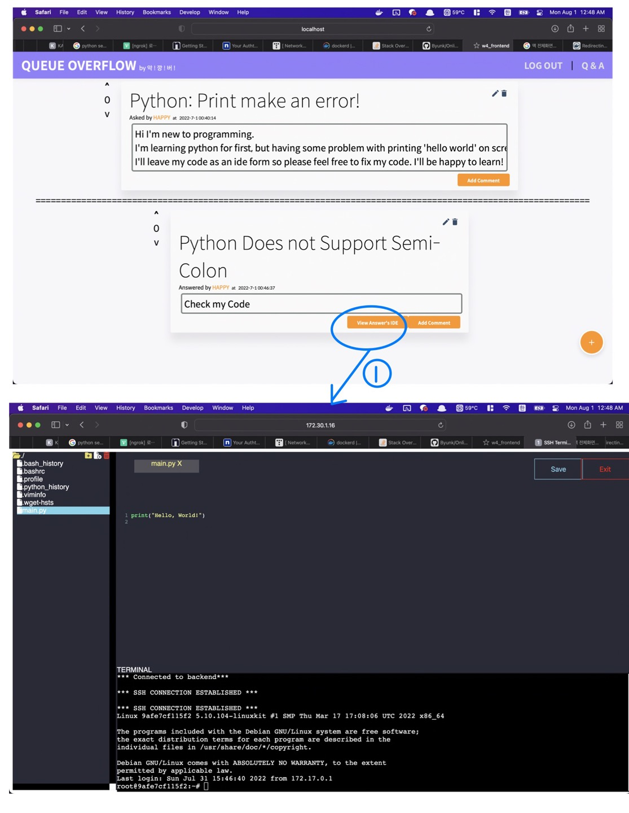
- 1: Press the **View Answer's IDE**. You can see the answer's code.

 

 

# **3. Technique Used**
## WEB
- Vue
## BACKEND
- MYSQL
## WEB IDE
- Docker
- XTerm.js
- JQUERY

 

# **4. Team Information**

| Name | GitHub | Responsibility | Major | Contact Information |
| --- | --- | --- | --- | --- |
| Kyungho Byoun | Byunk | Creating Docker Container, Images | KAIST Aerospace Engineering & Computer Science | clearman001@kaist.ac.kr |
| PARK JONGEUN | zhorassicpark | Frontend, Backend Developer for the site | KAIST Electrical Engineering & Chemical and Biomolecular Engineering | abepje@kaist.ac.kr  |
| Jaejun Han | HackerTiger | WEB IDE Developer | KAIST Electrical Engineering & Computer Science | hanjj03@naver.com |